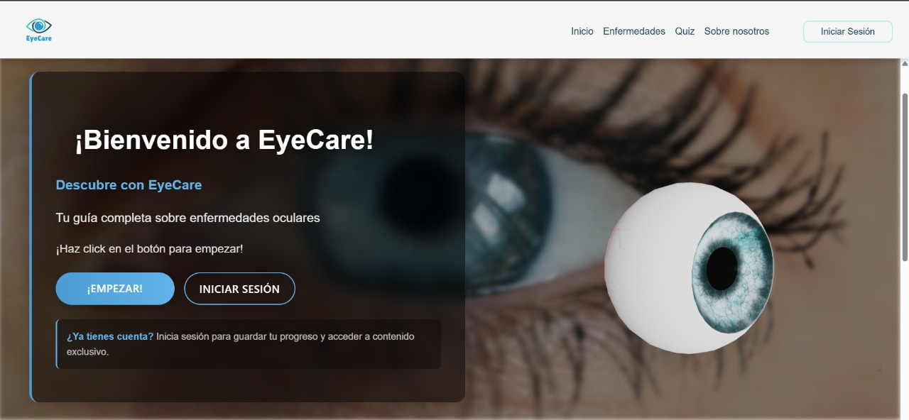

# 👁 EyeCare - Exploración 3D de Enfermedades Oculares



## 📋 Descripción del Proyecto

EyeCare es una aplicación web interactiva en 3D que proporciona información educativa sobre enfermedades oculares comunes como degeneración macular, cataratas, glaucoma y conjuntivitis. El proyecto utiliza visualizaciones tridimensionales, animaciones y contenido interactivo para ofrecer una experiencia de aprendizaje inmersiva sobre la salud ocular.

## ✨ Características Principales

- *Modelos 3D Interactivos*: Visualización detallada de órganos oculares y patologías
- *Animaciones Educativas*: Efectos visuales que muestran síntomas y progresión de enfermedades
- *Contenido Multimedia*: Videos informativos integrados sobre tratamientos y prevención
- *Experiencia Interactiva*: Control mediante teclado y mouse para explorar los modelos


## 🚀 Demo

Visita la aplicación en: [https://eye-care-pi-5.vercel.app](https://eye-care-pi-5.vercel.app)

## 🛠 Tecnologías Utilizadas

### Frontend
- *React*: Framework principal para la interfaz de usuario
- *Vite*: Herramienta de compilación que proporciona un entorno de desarrollo rápido
- *Three.js*: Biblioteca JavaScript para crear y mostrar gráficos 3D animados
- *React Three Fiber*: Renderizador React para Three.js
- *React Three Drei*: Colección de helpers para React Three Fiber
- *CSS3*: Estilos personalizados y animaciones

### Modelado 3D
- *Modelos de ojo 3D*: Representaciones detalladas del ojo humano y patologías optimizadas en blender.
- *Animaciones 3D*: Simulaciones de síntomas y efectos de enfermedades

### Interactividad
- *Keyboard Controls*: Sistema de control por teclado para la navegación
- *Orbit Controls*: Navegación orbital para explorar modelos en 360°


## 🏁 Inicio Rápido

```bash 
# Clonar el repositorio
git clone https://github.com/wilvelasco1006/EyeCare.git

# Navegar al directorio del proyecto
cd EyeCare

# Instalar dependencias
npm install

# Iniciar servidor de desarrollo
npm run dev
```

## 📱 Controles de Usuario

- *Mouse*: Rotar y explorar modelos 3D
- *Rueda del Mouse*: Zoom in/out
- *Tecla R*: Reiniciar vista
- *Tecla T*: Ver más detalles sobre tratamientos (en algunas secciones)

## 📚 Estructura del Proyecto

```
EyeCare/
├── src/
│   ├── pages/
│   │   ├── diseases/
│   │   │   ├── Cataracts/
│   │   │   ├── Glaucoma/
│   │   │   └── Conjuntivitis/
│   │   └── ...
│   ├── components/
│   ├── assets/
│   └── ...
├── public/
└── ...
```


## 🤝 Contribuciones

Las contribuciones son bienvenidas. Por favor, abre un issue o envía un pull request para sugerir cambios o mejoras.

## 📝 Licencia

Este proyecto está bajo la Licencia MIT - ver el archivo [LICENSE](LICENSE) para más detalles.

## 👨‍💻 Autores 

- *Wilmer Yulian Ulcue Velasco* - [wilvelasco1006](https://github.com/wilvelasco1006)
- *Juan Carlos Reinosa Gallego* - [JuanR66803](https://github.com/JuanR66803)
- *Oliver David Plazas Fuentes* - [Athelstan53](https://github.com/Athelstan53)
- *Jaider Daniel Rios Acosta* - [JaiderDanielRiosAcosta](https://github.com/JaiderDanielRiosAcosta)

---

Desarrollado con ❤ para la educación en salud ocular
